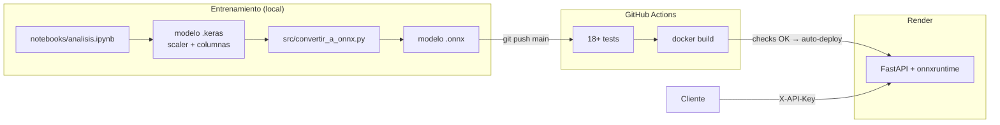

# Predicción del Abandono Estudiantil


API que predice el riesgo de que un estudiante universitario **abandone** sus estudios, usando la información disponible al terminar el **1er semestre**. El objetivo es detectar a tiempo a quién ofrecer apoyo (tutorías, orientación, ayuda económica).

**🌐 API en producción:** https://prediccion-abandono-api.onrender.com/docs

| | |
|---|---|
| **Modelo** | Red neuronal (Keras), servida en formato ONNX |
| **AUC-ROC (test)** | 0.946 |
| **Recall Dropout** | 0.88 (detecta ~88 de cada 100 estudiantes que abandonan) |
| **Stack** | FastAPI · onnxruntime · Docker · GitHub Actions · Render |

Detalles del modelo, datos, métricas y limitaciones: **[Model Card](docs/MODEL_CARD.md)**.

## Probar la API

1. Abre https://prediccion-abandono-api.onrender.com/docs
2. Pulsa **Authorize** e ingresa tu API key.
3. En `POST /predecir` → **Try it out** → **Execute**: el body ya trae un estudiante real de ejemplo.

> En el plan gratuito de Render el servicio se duerme tras ~15 min sin uso: la primera request puede tardar ~50 segundos.

Con `curl`, usando el ejemplo de [`docs/ejemplo_request.json`](docs/ejemplo_request.json):
```
curl -X POST https://prediccion-abandono-api.onrender.com/predecir \
  -H "Content-Type: application/json" \
  -H "X-API-Key: tu-clave" \
  -d @docs/ejemplo_request.json
```

Respuesta:
```json
{"probabilidad_dropout": 0.0399, "prediccion": "Graduate", "riesgo": "bajo"}
```

| Endpoint | Método | Auth | Descripción |
|---|---|---|---|
| `/` | GET | — | Mensaje de bienvenida |
| `/salud` | GET | — | Estado de la API y del modelo (health check) |
| `/predecir` | POST | `X-API-Key` | Recibe las 28 features y devuelve probabilidad, clase y riesgo |

Niveles de riesgo: **bajo** (< 0.4), **medio** (0.4 – 0.7), **alto** (≥ 0.7).

> ⚠️ Las variables categóricas usan la codificación del dataset de entrenamiento (ej: `Course` va de 1 a 17). Ver los rangos válidos en la [model card](docs/MODEL_CARD.md#anexo-rangos-de-las-variables).

## Arquitectura



**Flujo de una predicción:** request → validación (API key, rate limit, 28 features) → preprocesamiento (mismo orden de columnas y mismo `StandardScaler` del entrenamiento) → modelo ONNX → probabilidad + clase + riesgo.

**¿Por qué ONNX?** La red se entrena con Keras, pero en producción predice con **onnxruntime** (~50 MB) en vez de TensorFlow (~1.5 GB): la imagen Docker es mucho más liviana, arranca más rápido y cabe en los 512 MB de RAM del plan gratuito de Render. La conversión se verifica automáticamente (diferencia máxima vs Keras: 1.2e-7).

## Estructura del proyecto

```
├── api/main.py            # API FastAPI: endpoints, seguridad, logging, docs
├── src/
│   ├── config.py          # Rutas y constantes
│   ├── preprocessing.py   # Mismo preprocesamiento que en el entrenamiento
│   ├── model.py           # Carga el modelo ONNX y predice
│   └── convertir_a_onnx.py
├── modelos/               # .keras (entrenamiento), .onnx (producción), scaler y columnas
├── notebooks/             # EDA y entrenamiento
├── data/dataset.csv
├── tests/                 # pytest
├── docs/                  # Model card y ejemplo de request
├── Dockerfile
├── render.yaml            # Servicio de Render como código
├── requirements.txt       # Producción (sin TensorFlow)
└── requirements-dev.txt   # Producción + TensorFlow, ONNX y tests
```

## Desarrollo local

```
python -m venv venv
source venv/Scripts/activate      # Git Bash en Windows
pip install -r requirements-dev.txt

export API_KEY=clave-local        # la API no arranca sin API_KEY
uvicorn api.main:app --reload     # → http://localhost:8000/docs
```

Con Docker:
```
docker build -t dropout-api .
docker run -p 8000:8000 -e API_KEY=clave-local dropout-api
```

### Variables de entorno

| Variable | Obligatoria | Default | Descripción |
|---|---|---|---|
| `API_KEY` | Sí | — | Clave que exige `/predecir` en el header `X-API-Key` |
| `LOG_LEVEL` | No | `INFO` | `DEBUG`, `INFO`, `WARNING` o `ERROR` |
| `PORT` | No | `8000` | Puerto de uvicorn (Render lo asigna solo) |

### Reentrenar el modelo

1. Reentrenar en `notebooks/analisis.ipynb` (guarda `.keras`, scaler y columnas en `modelos/`).
2. `python src/convertir_a_onnx.py` → regenera el `.onnx` y verifica que prediga igual que Keras.
3. `pytest -v` y push a `main`: el CI valida y Render despliega.
4. Actualizar las métricas en la [model card](docs/MODEL_CARD.md).

## Tests

```
pytest -v
```

| Archivo | Qué cubre |
|---|---|
| `test_preprocessing.py` | Orden de columnas, columnas faltantes y tipo de salida |
| `test_model.py` | Carga del modelo, formato de la predicción y **equivalencia ONNX vs Keras** |
| `test_api.py` | Endpoints, predicción de un estudiante real, **API key**, **validación**, **rate limit** y **request ID** |

Los tests usan una `API_KEY` de prueba definida en `tests/conftest.py`: no hace falta configurar ninguna clave para correrlos.

## Seguridad

- **API key** en el header `X-API-Key`, comparada en tiempo constante. Sin ella o incorrecta → `401`. La clave vive en variables de entorno, nunca en el código.
- **Rate limiting:** 10 requests por minuto por IP en `/predecir` → `429`. Detrás del proxy de Render se usa la IP real del cliente (`--proxy-headers`).
- **Validación de entrada:** exactamente las 28 features del entrenamiento; si falta o sobra alguna → `422`.
- **Errores internos:** se registran en el log; al cliente solo le llega un mensaje genérico (`500`).
- **Contenedor sin root** (usuario `appuser`).

## Logging

Logs en stdout (Render los muestra en su panel *Logs*):

- Una línea por request: `request_id`, método, ruta, status y duración en ms.
- Una línea por predicción con el resultado. **Las features del estudiante no se loguean** (son datos personales).
- `WARNING` ante intentos de acceso con API key ausente o inválida (la key recibida nunca se escribe).
- Cada respuesta trae el header `X-Request-ID` para ubicar esa request en los logs. El cliente puede enviar el suyo (solo alfanumérico, `-` y `_`, para evitar inyección en los logs).

## CI/CD y deploy

- **GitHub Actions** (`.github/workflows/ci.yml`): en cada push o pull request a `main` corre los tests y valida el build de Docker.
- **Render** (`render.yaml`): auto-deploy **solo después de que pasan los checks** de GitHub. Antes de enviar tráfico a una versión nueva, Render verifica `/salud`. La `API_KEY` se configura en el panel de Render.

## Roadmap

- [x] Fase 1: Modularización
- [x] Fase 2: Dockerización
- [x] Fase 3: Testing
- [x] Fase 4: CI/CD
- [x] Fase 5: Seguridad
- [x] Fase 6: Deploy + Logging
- [x] Fase 7: Documentación

**Próximos pasos posibles:** validar rangos de cada feature en la API, evaluar *fairness* por subgrupos (género, edad, nacionalidad), probar one-hot encoding para las variables categóricas y monitorear la deriva de los datos.

## Autora

Niurka Vanesa Yupanqui
